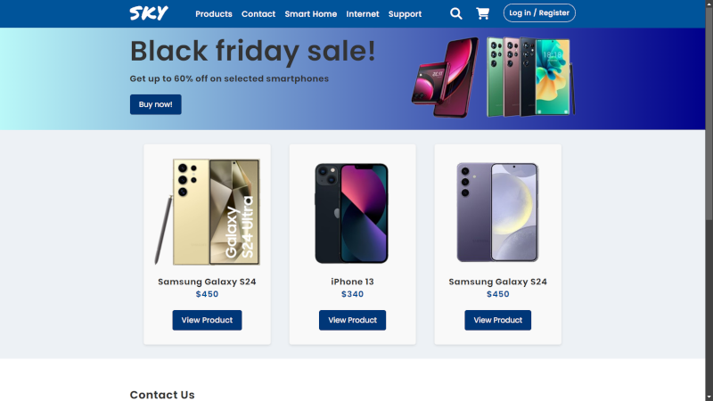

# SKY Telecom

This project was developed for Program Developer students, focusing on tools like Git and GitHub while working remotely. This web application was designed for a fictional company 'SKY Telecom', and includes features such as a product catalog, user authentication, dropdown menus, modal dialogs, and responsive design. Below are the details of the project's structure and functionality.



## 📑Table of Contents
- [Technologies Used](#technologies-used)
- [Installation](#installation)
- [Usage](#usage)
- [Project Structure](#project-structure)
- [Features](#features)

## 🖥️Technologies Used


## 🖱️Installation
To run this project locally, follow these steps:
1. Clone the repository:
    ```sh
    git clone https://github.com/fabianmendozaospina/sky-telecom.git
    ```
2. Navigate to the project directory:
    ```sh
    cd sky-telecom
    ```
3. Open `index.html` in your browser to view the application.

## Usage
The application includes various features for both users and administrators:
- Browse the product catalog.
- View detailed information about products.
- Log in or register as a user.
- Contact support through the contact form.

## Project Structure
The project is organized as follows:
- `index.html`: Main HTML file containing the structure of the web application.
- `style.css`: Stylesheet file for the application's layout and design.
- `utils.js`: Utility JavaScript for functions, event listeners and functionality.
- `main.js`: Main JavaScript file responsible for initializing and managing 
core application interactions, leveraging utility functions from `utils.js`.


## 💡Features
### Header
- Logo and navigation menu.
- Search and cart icons.
- Dropdown menu for additional links.

### Banner 
- Prominent hero banner to showcase key promotions or announcements.
- Visually engaging with space for images and text.

### Modal Dialog
- Log in/Register modal for user authentication.
- Form validation and submission.

### Product Catalog
- Display of product images, names, prices, and view product buttons.
- Responsive grid layout for product display.

### Contact Us
- Contact form for users to send messages.
- Input fields for name, email, and message, with validation.

### Footer
- Social media links.
- Company information.

&copy; Created by MITT Software Students.